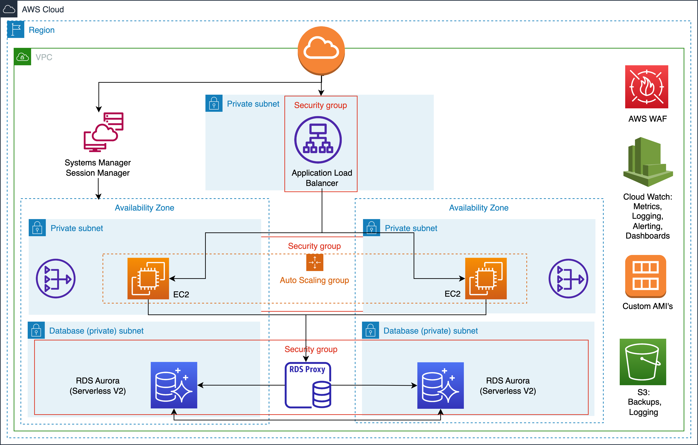

<h1 align="center">
  <br/><br/>
</h1>

# Terraform configuration to provision a highly available, stateless monolithic application on AWS.

This Terraform module provisions a highly available, stateless monolithic application on AWS.

## Features

* Provisions all resources required to setup a production grade environment.
* Conforms with industry best practices regarding, Security, Reliability, APM, Access control etc.
* GitHub actions for CI/CD integration.
* Works with AWS Systems Manager Session Manager eliminating the need to manage SSH keys, or open port 22.

## Requirements

* Terraform version: ~> 1.2
* AWS Provider version: ~> 4.0

## Terraform version compatibility

| Module version | Terraform version |
|----------------|-------------------|
| 0.x.x          | ~> 1.2            |

## Services Used


| Name | Rationale | Tradeoffs | Alternative Configuration |
|------|-----------|-----------|-------------------------|
| Application Load Balancer | Enables load balancing and distribution of traffic to the application instances. Other alternatives like the Network Load Balancer and Classic Load Balancer lack more advanced features like HTTP header based routing. | Requires additional configuration and setup. May introduce additional latency. | Network Load Balancer, Classic Load Balancer |
| Autoscaling Groups | Dynamically scales EC2 instances based on defined scaling policies and metrics.  By utilizing Autoscaling Groups, we can automatically adjust the number of instances based on demand, ensuring optimal resource utilization. Although configuration and monitoring of scaling policies are required, Autoscaling Groups offer cost efficiency and resilience, justifying their selection. | Requires configuration and monitoring of scaling policies. Additional costs may be incurred for running more instances. | AWS Fargate, Kubernetes Autoscaling |
| RDS Aurora Serverless (V2) | Serverless and automatically scales Aurora database capacity based on usage. With RDS Aurora Serverless, we can eliminate the need to manually provision and manage database instances, allowing for effortless scaling. While there is limited control over database instance configuration and scaling operations may introduce some latency, the benefits of automatic scaling and reduced management overhead make RDS Aurora Serverless (V2) a suitable choice. | Limited control over database instance configuration. May introduce latency during scaling operations. | RDS, RDS Aurora Auto Scaling |
| RDS Proxy | Provides connection pooling, load balancing, and high availability for RDS database connections. By leveraging RDS Proxy, we can improve the performance and availability of database connections. Although additional costs may be incurred for using RDS Proxy and it requires configuration and management of proxy settings, the benefits it brings outweigh these tradeoffs. | Additional costs may be incurred for using RDS Proxy. Requires configuration and management of proxy settings. | Database connection pooling libraries (e.g., HikariCP, C3P0) |
| CloudWatch Dashboards | Provides a centralized view of key metrics and visualizations for monitoring purposes. While alternatives such as Grafana and Datadog offer customization options for dashboard layouts, the convenience, ease of setup and tight integration with AWS resources make CloudWatch Dashboards a suitable choice. | Limited customization options for dashboard layouts. | Grafana, Datadog |
| CloudWatch Monitoring | Monitors and collects metrics, logs, and events from various AWS resources.  While alternatives like Prometheus and New Relic exist, the native integration with AWS services and the ease of setup and configuration make CloudWatch Monitoring the ideal choice. | Additional costs may be incurred for storing and processing large volumes of data. | Prometheus, New Relic |
| CloudWatch Alerting (with Slack) | Allows setting up automated notifications and alarms based on defined thresholds and metrics.  While other options like PagerDuty provide similar functionality, CloudWatch Alerting seamlessly integrates with the rest of the AWS ecosystem, simplifying the overall monitoring and alerting setup.| Requires configuration and management of alarm thresholds and notification settings. Limited functionality. | PagerDuty |
| CloudWatch Logging | Collects and stores logs generated by AWS resources and applications. Although alternatives like the ELK Stack (Elasticsearch, Logstash, Kibana) and Splunk offer advanced log management features, the native integration with AWS resources and the ease of setup make CloudWatch Logging a preferable choice. | Additional costs may be incurred for storing and processing large volumes of log data. | ELK Stack (Elasticsearch, Logstash, Kibana), Splunk |
| S3 (Logging/Log Sinks) | Enables logging and storage of VPC flow logs, and ALB access logs.  The service provides a reliable and scalable solution for log management. By leveraging S3, we can centralize log storage, allowing for easy access, analysis, and long-term retention of log data. The cost benefits and long-term reliability outweigh the tradeoffs. | Additional costs may be incurred for storing and retrieving log data. Might require more complex Data visualization/ querying services. | Elasticsearch, Logstash, Kibana (ELK Stack), Splunk |
| AWS VPC | Provides isolated virtual networks for resources and enables secure communication between them. AWS VPC is the only realistic solution for AWS-centric deployments. | Requires network configuration and management. May introduce additional complexity. | n/a |
| VPC Endpoints | Enables secure and private communication between VPCs and AWS services without internet exposure. By utilizing VPC Endpoints, we can enhance security and reduce data transfer costs by avoiding internet traffic. Although configuring and managing VPC endpoints for specific services is required, the benefits of secure and direct communication justify this tradeoff. | Requires configuration and management of VPC endpoints for specific services. | Direct Connect, Transit Gateway |
| Security Groups | Controls inbound and outbound traffic for AWS resources. Network ACLs and WAFs are alternative solutions for network security, but they typically operate at the subnet or application layer. Security Groups provide a more comprehensive and centralized approach to security management, making them a preferred choice for controlling traffic. | Requires careful configuration and management to ensure proper network security. While careful configuration and management are required to ensure proper network security, the benefits of having precise control over traffic flow justify this tradeoff.| Network Access Control Lists (ACLs), Web Application Firewalls (WAFs) |
| SSM Parameter Store | Stores and manages configuration parameters and secrets for applications. While alternatives like HashiCorp Vault and AWS Secrets Manager offer similar capabilities, the native integration with AWS resources and simplified management make SSM Parameter Store a suitable choice. | Access to stored parameters and secrets must be properly controlled and secured. | HashiCorp Vault, AWS Secrets Manager |
| Secrets Manager | Securely stores and manages sensitive information such as database credentials and API keys. Although alternatives like HashiCorp Vault and AWS SSM Parameter Store exist, Secrets Manager seamlessly integrates with the rest of the AWS ecosystem (e.g Secret injection, Secret Rotation) | Additional costs may be incurred for storing and retrieving secrets. | HashiCorp Vault, AWS SSM Parameter Store |
| Secrets Manager Secrets Rotations | Automates the rotation of secrets, enhancing security by regularly updating sensitive information. While a custom script or orchestration tool can achieve similar results, Secrets Manager Secrets Rotations provide a streamlined and managed approach to secret rotation. | Requires additional setup and configuration for secret rotation policies. | Custom script or orchestration tool for secret rotation |
| IAM | Manages access and permissions to AWS resources and services. Although alternatives like Azure Active Directory and Okta provide similar capabilities, IAM offers seamless integration with AWS services and fine-grained control over access controls. | Requires careful management and review of IAM policies to ensure proper access controls. | Azure Active Directory, Okta |
| Route 53 | Manages DNS and domain name routing for applications. With Route 53, we can easily configure and manage DNS records, including routing traffic to various AWS services. | Requires proper configuration and management of DNS records. | Cloudflare, Google Cloud DNS |
| AWS Certificate Manager | Manages and provisions SSL/TLS certificates for secure communication.  While Let's Encrypt and custom certificate management solutions are available, AWS Certificate Manager provides a seamless experience with automated renewal and integration with other AWS services (e.g ALB, Route53). | Requires renewal and management of certificates within the Certificate Manager. | Let's Encrypt, Custom Certificate Management Solution |
| AWS Systems Manager Session Manager | Provides secure and controlled access to instances for remote management and troubleshooting without the need for SSH. Eliminates the need to manage SSH keys and open inbound network ports. Session recordings are stored in S3 for auditing and compliance. | Developers/ Ops might be unfamiliar with the service. | SSH |

## Usage

```bash
terraform init
terraform plan -var-file="./varfiles/staging.tfvars"
terraform apply --auto-approve -var-file="./varfiles/staging.tfvars"
```

## Inputs/ Variables
| Name                      | Description                                                                                        | Type             | Default       | Required |
|---------------------------|----------------------------------------------------------------------------------------------------|------------------|---------------|----------|
| profile                   | AWS Profile to use (should already exist).                                                         | `string`         | `"default"`   | No       |
| region                    | Default AWS region.                                                                                | `string`         | `"us-east-1"` | No       |
| environment               | Current Environment                                                                                | `string`         | n/a           | Yes      |
| prefix                    | Prefix to prepend to resources (for easy identification).                                           | `string`         | n/a           | No       |
| assume_role_arn           | AWS role to assume when provisioning resources                                                      | `string`         | `""`          | No       |
| assume_role_external_id   | Extenal ID associated with the "assume_role_arn".                                                   | `string`         | `""`          | No       |
| route53_zone_name         | Route 53 Zone domain name to create ALB record in, no records will be created if this is left empty. | `string` or `null` | `null`        | No       |
| create_route53_zone       | Should the Route53 Zone be created, you'll need to add the NS records to your Registrar for ACM certificate validations to pass. | `bool`           | `false`       | No       |
| alb_subdomain             | Subdomain for the ALB, defaults to domain_name if not passed.                                       | `string` or `null` | `null`        | No       |
| backend_port              | Port ALB directs instance traffic to.                                                               | `number`         | `80`          | No       |
| slack_webhook_url         | Webhook URL for configurations Slack notifications/ alerts.                                         | `null`           | `null`        | No       |

**Note:** For variables with a default value, they are not marked as required.


An example tfvars file is available in `varfiles/staging.tfvars.example`.

```hcl
profile = "default"
region  = "us-east-1"

assume_role_arn         = "arn:aws:iam::1234567890:role/ci-runner"
assume_role_external_id = "ci-runner"

environment = "staging"
prefix      = "careviso"

create_route53_zone = true
route53_zone_name   = "careviso.com"

slack_webhook_url = "https://hooks.slack.com/services/1245XXXXX"

```

## Further additions

* AWS WAF with protection for OWASP top 10 Web applicaiton vulnerabilities.
* AWS Shield for DDOS protection.
* CloudFront for Caching.
* Packer for creation Custom AMI's.
